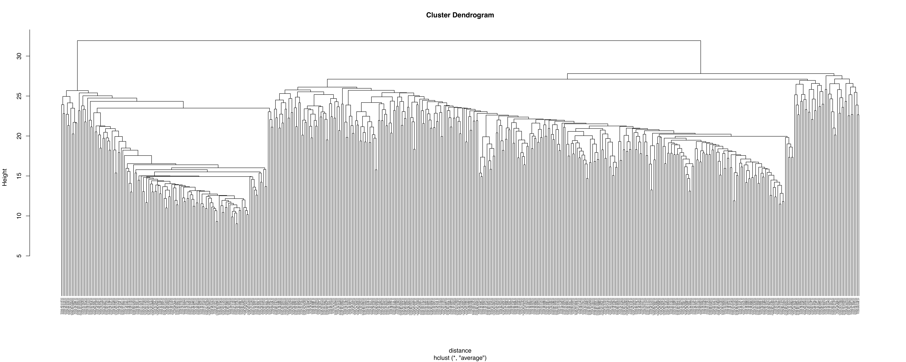
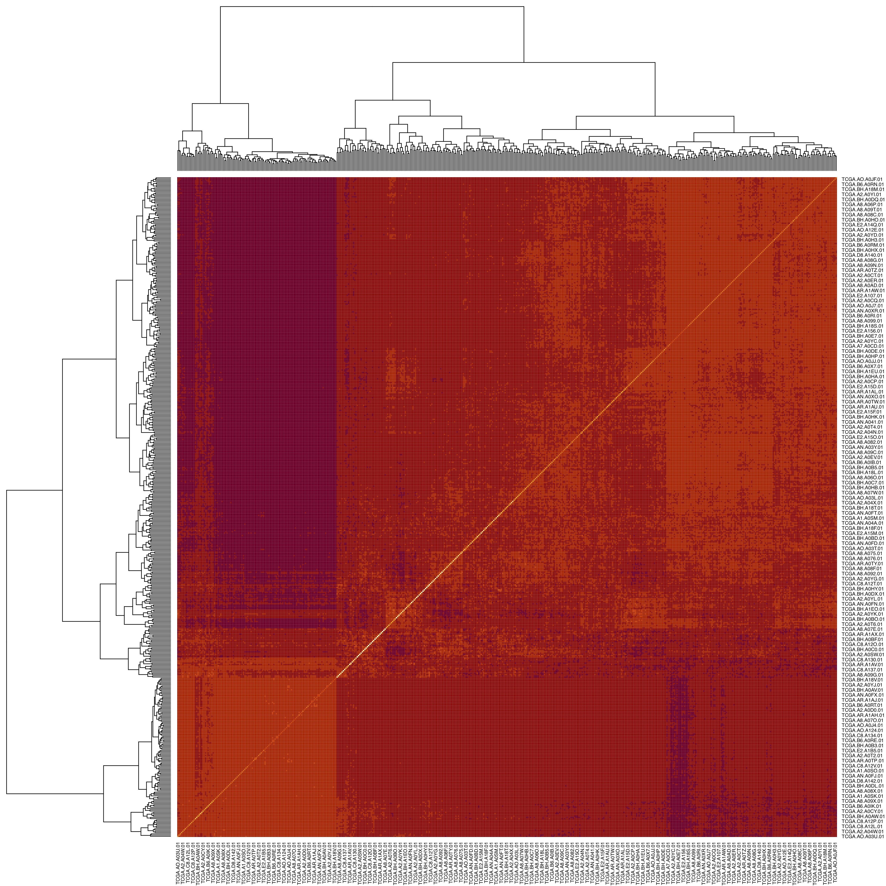
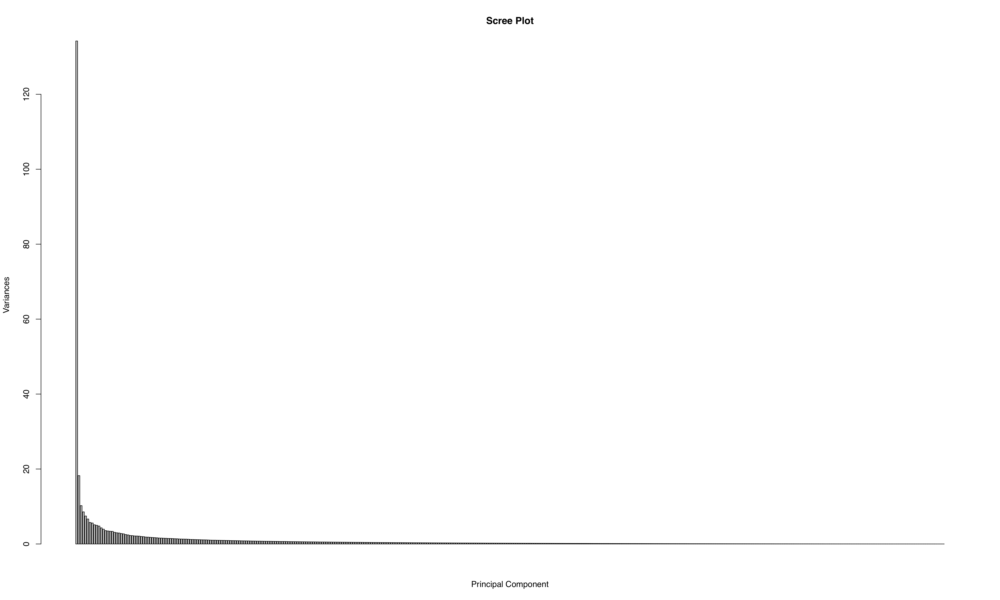
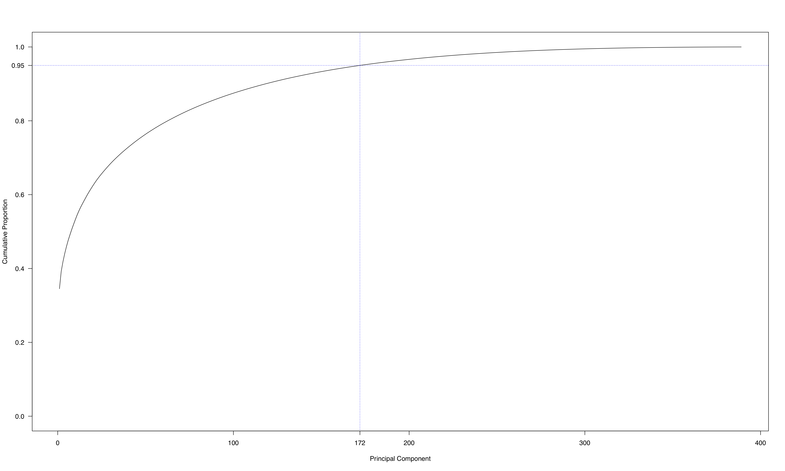
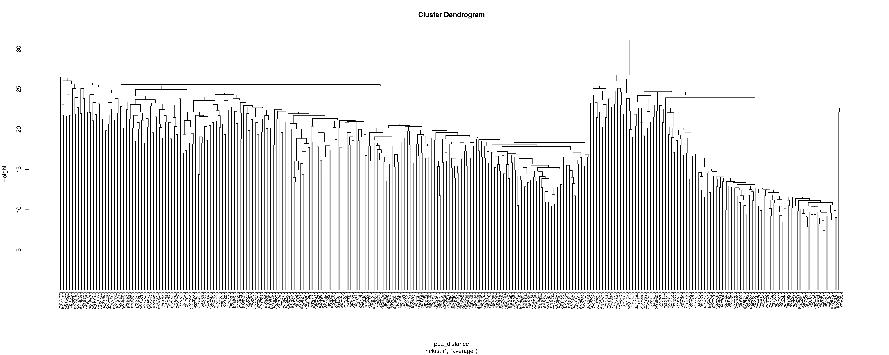
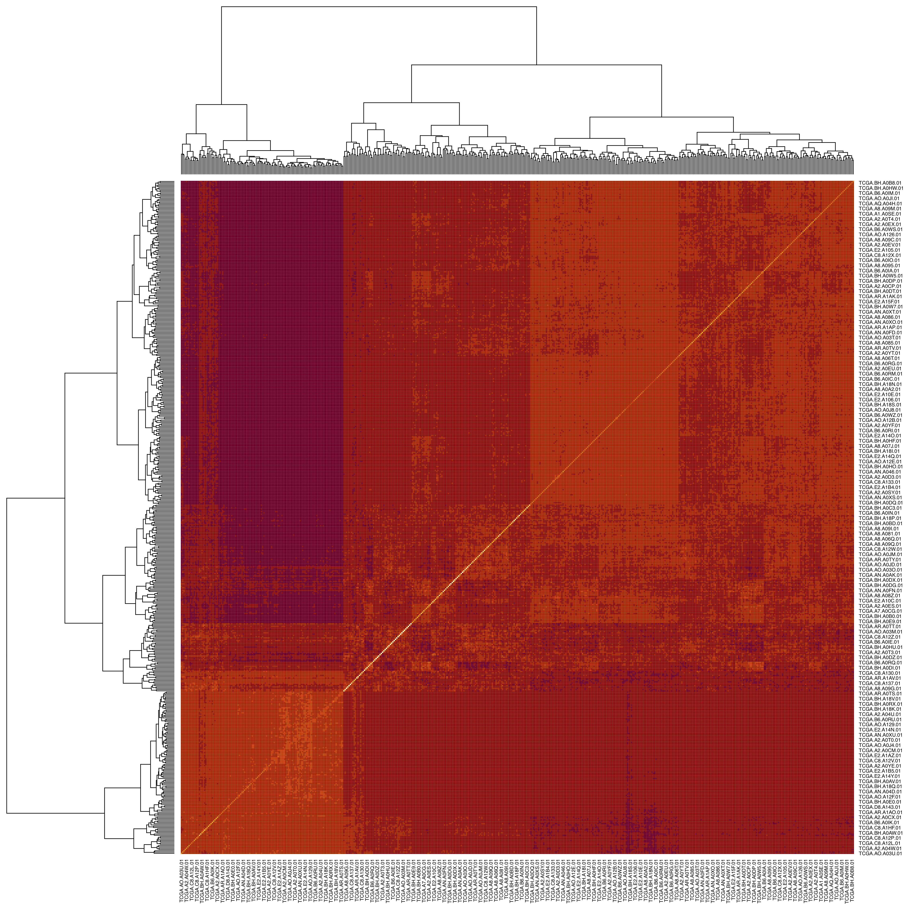
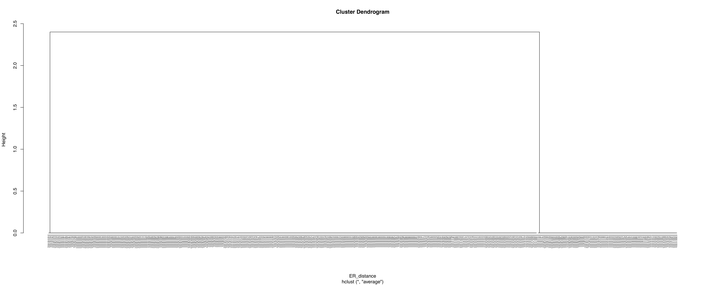
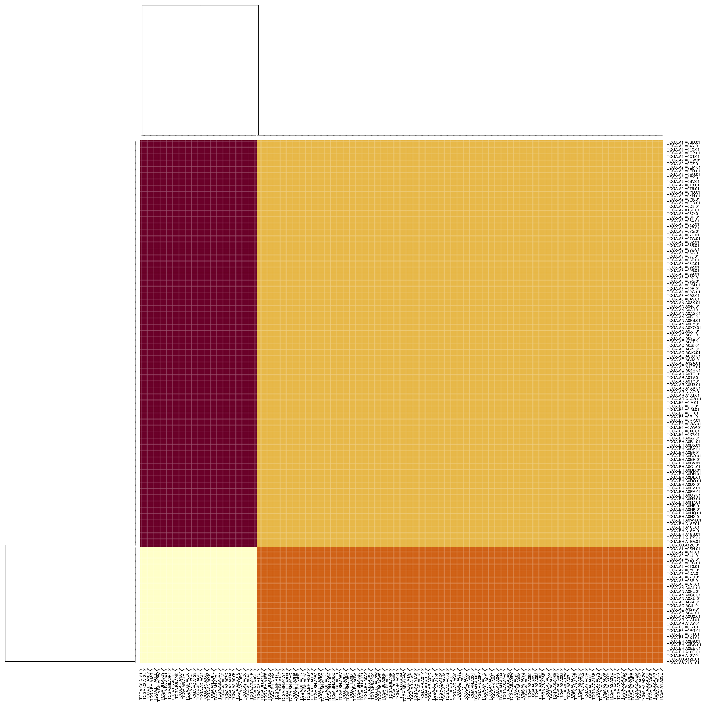

# TCGA-BRCA-cluster
大二上, 生物信息学概论, Homework2——聚类分析TCGA-BRCA数据


### 聚类分析病人乳腺癌的基因芯片数据（转录组）

**1. 层次聚类GeneMatrix样本**

利用层次聚类，将GeneMatrix中数据样本（共522个病例），按照基因表达水平（共389个不同的基因）进行聚类：

```R
GeneMatrix <- read.table(file = "./GeneMatrix.txt", header = TRUE, sep = "\t", row.names = 1) # 读取GeneMatrix.txt数据
GeneMatrix <- t(scale(GeneMatrix)) # 数据标准化，矩阵转置
distance <- dist(GeneMatrix, method = "euclidean") # 计算距离
fit <- hclust(distance, method = "average") # 层次聚类
```

聚类效果如图所示：

```R
plot(fit, hang = -1, cex = 0.3) # 作图
```




 [cluster.pdf](cluster.pdf) 

```R
heatmap(as.matrix(distance)) # 聚类并作图（热点图）
```



 [heatmap.pdf](heatmap.pdf) 

**2. 对GeneMatrix样本进行PCA降维后再进行层次聚类**

利用PCA对该组数据的基因表达进行降维处理：

```R
pca <- prcomp(GeneMatrix, center = FALSE, scale = FALSE) # PCA主成分分析
```

因为前172个主成分能够表征全部数据95.004%的信息，信息损失率小于5%，因此采用的主成分数目为172。

```R
screeplot(pca, type = "barplot", npcs = length(pca$sdev), main = "Scree Plot", xlab = "Principal Component") # 可视化PCA后Variance数据
```



 [pca_screeplot.pdf](pca_screeplot.pdf) 

```R
plot(summary(pca)$importance[3:3, 1:389], ylim = c(0.0, 1.0), xlab = "Principal Component", ylab = "Cumulative Proportion", type = "l", las = 1) # 选取PCA后Cumulative Proportion数据作图
abline(v = 172, lwd = 1, lty = 3, col = "blue")
abline(h = 0.95, lwd = 1, lty = 3, col = "blue")
axis(side = 2, at = c(0.95), las = 2, labels = c("0.95"))
axis(side = 1, at = c(172), labels = c("172"))
pca.data <- data.frame(pca$x[,1:172]) # 选取前172个主成分
```



 [pca_cumulative.pdf](pca_cumulative.pdf) 

依据该172个特征，再次对病人进行聚类，聚类效果如图所示（代码与1中同理，具体可详见 [cluster.R](cluster.R) 文件）：



 [pca_cluster.pdf](pca_cluster.pdf) 



 [pca_heatmap.pdf](pca_heatmap.pdf) 

与1比较，可以看出聚类效果相似（左图为PCA降维前热点图，右图为PCA降维后热点图），验证了PCA的正确性，该172个主成分可以聚类该组数据。

 

**3. 依据clinical_data中的分类标准来检验层次聚类及PCA的正确性**

最后，根据clinical_data中ER_Status_nature2012的指标（仅选取GeneMatrix与clinical_data所共有的病例，即对二者病例取交集，共440个）进行分类：

```R
# 导入clinical_data数据，并保留ER_Status_nature2012列
clinical_data <- read.table(file = "./clinical_data.txt", header = TRUE, sep = "\t", row.names = 1) 
ER_Status_nature2012 <- clinical_data[7:7]

# 处理ER_Status_nature2021的行名（病例名）
for (i in 1:771)
  row.names(ER_Status_nature2012)[i] <- chartr("-", ".", row.names(ER_Status_nature2012)[i])

# 选取GeneMatrix与clinical_data病例的交集
ER_Status_nature2012$patient <- row.names(ER_Status_nature2012)
ER_Status_nature2012 <- subset(ER_Status_nature2012, patient %in% row.names(GeneMatrix))
ER_Status_nature2012 <- ER_Status_nature2012[1:1]

# 将ER_Status_nature2012指标由chr类型转为factor类型再转为numeric类型
library(dplyr)
ER_Status_nature2012 <- mutate_at(ER_Status_nature2012, vars(ER_Status_nature2012), as.factor)
ER_Status_nature2012$ER_Status_nature2012 <- as.numeric(ER_Status_nature2012$ER_Status_nature2012)
ER_Status_nature2012 <- scale(ER_Status_nature2012)
```

分类效果如图所示（代码与1中同理，具体可详见 [cluster.R](cluster.R) 文件）：



 [ER_cluster.pdf](ER_cluster.pdf) 



 [ER_heatmap.pdf](ER_heatmap.pdf) 

与1、2比较，可以看出分类效果相似（从左至右依次为1、2、3的热点图），即按照这个分类标准评估1、2中的聚类，结果符合预期，验证了层次聚类及PCA的正确性。

  


